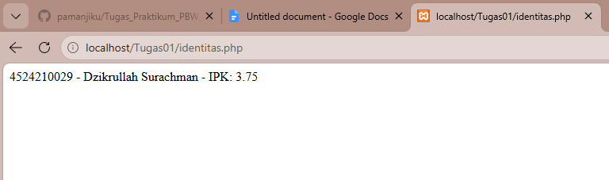
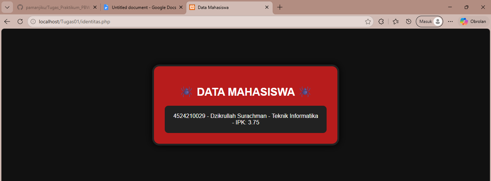
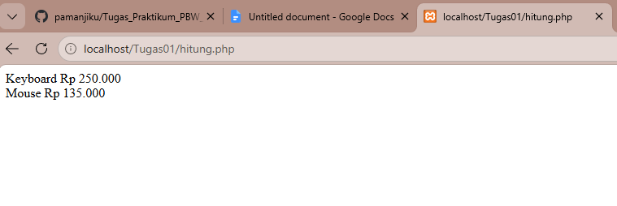
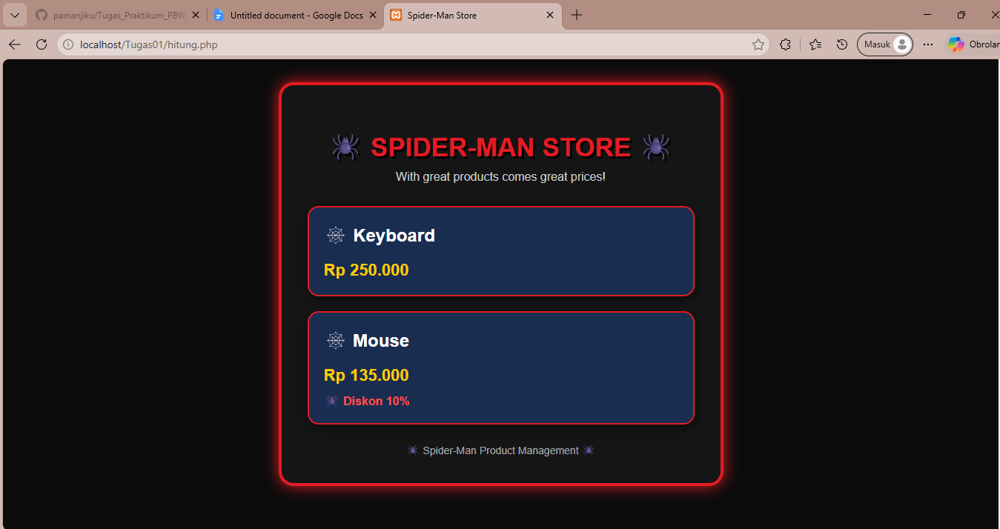

# Tugas 01 - Data Mahasiswa

## 1. Kode Asli

```php
<?php

interface identitas
{
    public function ringkasan(): string;
}

class Mahasiswa implements identitas
{
    private string $nim;
    private string $nama;
    private string $ipk;

    public function __construct(string $nim, string $nama, float $ipk)
    {
        $this->nim = $nim;
        $this->nama = $nama;
        $this->setIpk($ipk);
    }

    public function setIpk(float $ipk): void
    {
        if ($ipk < 0 || $ipk > 4) {
            throw new InvalidArgumentException('IPK harus 0 sampai 4.');
        }

        $this->ipk = $ipk;
    }

    public function getIpk(): float
    {
        return $this->ipk;
    }

    public function getIpk(): string
    {
        return $this->nim . ' - ' . $this->nama . ' - IPK: ' . $this->ipk;
    }
}

$mhs = new Mahasiswa(
    '4524210029',
    'Dzikrullah Surachman',
    '3.75'
);

echo $msh->ringkasan();
```
---

## 2. Kesalahan Kode Asli

### Kesalahan 1: Tipe Data `$ipk`

**Kode awal:**

```php
private string $ipk;
```

**Kode perbaikan:**

```php
private float $ipk;
```

**Penjelasan:**

IPK berupa angka desimal, sehingga tipe data yang sesuai adalah `float`, bukan `string`.

---

### Kesalahan 2: `getIpk()` Dibuat Dua Kali

**Kode awal:**

```php
public function getIpk(): float
{
    return $this->ipk;
}
```

Kemudian terdapat method dengan nama yang sama:

```php
public function getIpk(): string
{
    return $this->nim . ' - ' . $this->nama . ' - IPK: ' . $this->ipk;
}
```

**Masalahnya:**

PHP tidak memperbolehkan dua method dengan nama yang sama dalam satu class.

**Kode perbaikan:**

Method pertama tetap digunakan untuk mengambil nilai IPK:

```php
public function getIpk(): float
{
    return $this->ipk;
}
```

Method kedua diubah menjadi `ringkasan()`:

```php
public function ringkasan(): string
{
    return $this->nim . ' - ' . $this->nama . ' - IPK: ' . $this->ipk;
}
```

---

### Kesalahan 3: `$msh` Salah Penulisan

**Kode awal:**

```php
echo $msh->ringkasan();
```

**Kode perbaikan:**

```php
echo $mhs->ringkasan();
```

**Penjelasan:**

Object yang dibuat menggunakan nama `$mhs`, sehingga saat dipanggil harus menggunakan `$mhs`, bukan `$msh`.

---

### Kesalahan 4: Nilai IPK Menggunakan String

**Kode awal:**

```php
$mhs = new Mahasiswa(
    '4524210029',
    'Dzikrullah Surachman',
    '3.75'
);
```

**Kode perbaikan:**

```php
$mhs = new Mahasiswa(
    '4524210029',
    'Dzikrullah Surachman',
    3.75
);
```

**Penjelasan:**

Karena parameter IPK menggunakan tipe `float`, nilai `3.75` tidak perlu menggunakan tanda petik.

---

## 3. Kode yang Telah Diperbaiki

```php
<?php

interface identitas
{
    public function ringkasan(): string;
}

class Mahasiswa implements identitas
{
    private string $nim;
    private string $nama;
    private float $ipk;

    public function __construct(string $nim, string $nama, float $ipk)
    {
        $this->nim = $nim;
        $this->nama = $nama;
        $this->setIpk($ipk);
    }

    public function setIpk(float $ipk): void
    {
        if ($ipk < 0 || $ipk > 4) {
            throw new InvalidArgumentException('IPK harus 0 sampai 4.');
        }

        $this->ipk = $ipk;
    }

    public function getIpk(): float
    {
        return $this->ipk;
    }

    public function ringkasan(): string
    {
        return $this->nim . ' - ' . $this->nama . ' - IPK: ' . $this->ipk;
    }
}

$mhs = new Mahasiswa(
    '4524210029',
    'Dzikrullah Surachman',
    3.75
);

echo $mhs->ringkasan();
```

### Tampilan Output Awal

```text
4524210029 - Dzikrullah Surachman - IPK: 3.75
```

---

# 4. File Modifikasi

Pada tahap modifikasi, ditambahkan field baru yaitu **program studi (prodi)** dan tampilan dibuat menggunakan HTML dan CSS.

```php
<?php

interface identitas
{
    public function ringkasan(): string;
}

class Mahasiswa implements identitas
{
    private string $nim;
    private string $nama;
    private string $prodi;
    private float $ipk;

    public function __construct(
        string $nim,
        string $nama,
        string $prodi,
        float $ipk
    ) {
        $this->nim = $nim;
        $this->nama = $nama;
        $this->prodi = $prodi;
        $this->setIpk($ipk);
    }

    public function setIpk(float $ipk): void
    {
        if ($ipk < 0 || $ipk > 4) {
            throw new InvalidArgumentException(
                'IPK harus 0 sampai 4.'
            );
        }

        $this->ipk = $ipk;
    }

    public function getIpk(): float
    {
        return $this->ipk;
    }

    public function ringkasan(): string
    {
        return $this->nim
            . ' - ' . $this->nama
            . ' - ' . $this->prodi
            . ' - IPK: ' . $this->ipk;
    }
}

$mhs = new Mahasiswa(
    '4524210029',
    'Dzikrullah Surachman',
    'Teknik Informatika',
    3.75
);

?>

<!DOCTYPE html>
<html lang="id">

<head>
    <meta charset="UTF-8">
    <title>Data Mahasiswa</title>

    <style>
        body {
            background-color: #111;
            font-family: Arial, sans-serif;
        }

        .card {
            width: 450px;
            margin: 100px auto;
            padding: 30px;
            background-color: #b71c1c;
            color: white;
            text-align: center;
            border: 5px solid #222;
            border-radius: 20px;
            box-shadow: 0 0 20px black;
        }

        h1 {
            font-size: 30px;
        }

        .data {
            background-color: #222;
            padding: 20px;
            border-radius: 10px;
        }
    </style>
</head>

<body>

    <div class="card">

        <h1>🕷️ DATA MAHASISWA 🕷️</h1>

        <div class="data">
            <?= $mhs->ringkasan(); ?>
        </div>

    </div>

</body>

</html>
```

### Tampilan Output Setelah Modifikasi

Data mahasiswa yang ditampilkan menjadi:

```text
🕷️ DATA MAHASISWA 🕷️

4524210029 - Dzikrullah Surachman
- Teknik Informatika
- IPK: 3.75
```

Modifikasi yang dilakukan:

* Menambahkan field `prodi`.
* Menambahkan parameter `prodi` pada constructor.
* Menampilkan program studi pada method `ringkasan()`.
* Menambahkan HTML untuk tampilan halaman.
* Menambahkan CSS untuk membuat tampilan berbentuk card.
* Menampilkan data mahasiswa pada halaman web.
---
## Tampilan Tugas 1

### Tampilan Awal



### Tampilan Setelah Modifikasi


---

# 5. Lima Kode yang Penting

## 1. Interface `identitas`

```php
interface identitas
{
    public function ringkasan(): string;
}
```

**Fungsi:**
Membuat aturan bahwa class `Mahasiswa` harus memiliki method `ringkasan()`.

---

## 2. Deklarasi Atribut/Data Mahasiswa

```php
private string $nim;
private string $nama;
private string $prodi;
private float $ipk;
```

**Fungsi:**
Menyimpan data mahasiswa seperti NIM, nama, program studi, dan IPK.

`prodi` merupakan field baru yang ditambahkan pada tahap modifikasi.

---

## 3. Constructor

```php
public function __construct(
    string $nim,
    string $nama,
    string $prodi,
    float $ipk
) {
    $this->nim = $nim;
    $this->nama = $nama;
    $this->prodi = $prodi;
    $this->setIpk($ipk);
}
```

**Fungsi:**
Mengisi data mahasiswa ketika object `Mahasiswa` dibuat.

---

## 4. Validasi IPK

```php
if ($ipk < 0 || $ipk > 4) {
    throw new InvalidArgumentException(
        'IPK harus 0 sampai 4.'
    );
}
```

**Fungsi:**
Memastikan nilai IPK hanya berada pada rentang 0 sampai 4.

Jika IPK kurang dari 0 atau lebih dari 4, maka program akan memberikan error.

---

## 5. Method `ringkasan()`

```php
public function ringkasan(): string
{
    return $this->nim
        . ' - ' . $this->nama
        . ' - ' . $this->prodi
        . ' - IPK: ' . $this->ipk;
}
```

**Fungsi:**
Menggabungkan seluruh data mahasiswa menjadi satu teks yang kemudian ditampilkan pada halaman.

---

# 6. Error yang Sering Muncul

## Error: Not Found

Error **Not Found** terjadi karena Apache tidak menemukan file PHP pada alamat yang dibuka.

### Penyebab yang mungkin:

* File PHP tidak berada di folder `htdocs`.
* Nama folder tidak sesuai.
* Nama file tidak sesuai.
* URL yang dimasukkan salah.
* Apache belum aktif.

### Cara memperbaiki:

1. Pastikan file PHP berada di dalam folder `htdocs`.
2. Pastikan Apache sudah aktif pada XAMPP.
3. Periksa kembali nama folder dan file.
4. Buka URL sesuai dengan lokasi file.

Contoh:

```text
http://localhost/nama-folder/nama-file.php
```

---

# Kesimpulan

Pada tugas ini dilakukan perbaikan dan modifikasi program PHP berbasis OOP.

Perbaikan dilakukan dengan:

* Memperbaiki tipe data IPK dari `string` menjadi `float`.
* Menghapus method `getIpk()` yang dibuat dua kali.
* Memperbaiki penulisan `$msh` menjadi `$mhs`.
* Memperbaiki nilai IPK agar menggunakan tipe `float`.
* Memperbaiki pemanggilan method `ringkasan()`.

Kemudian dilakukan modifikasi dengan menambahkan data **program studi (`prodi`)** serta membuat tampilan data mahasiswa menggunakan **HTML dan CSS**.

Program akhir dapat menampilkan NIM, nama, program studi, dan IPK mahasiswa dalam bentuk tampilan card pada halaman web.
---


---
# Tugas 02 – Produk dan Produk Diskon

## 1. Kode Awal

```php
<?php

interface BisaDihitung
{
    public function hargaAkhir(): float;
}

claass Produk implements BisaDihitung
{
    public function __construct(
        protected string $nama,
        protected float $harga
    ) {}

    public function hargaAkhir(): float
    {
        return $this->harga;
    }

    public function getNama(): string
    {
        return $this->nama;
    }
}

class ProdukDiskon extends Produk
{
    public function __construct(
        string $nama,
        float $harga,
        private float $diskon
    ) {
        parent::__construct($nama, $harga);
    }

    public function hargaAkhir(): float
    {
        return $this->harga * (1 - $this_>diskon / 100);
    }
}

$daftar = [
    new Produk('Keyboard', 250000)
    new ProdukDiskon('Mouse', 150000, 10)
];

foreach ($daftar as $produk) {
    echo $produk->getNama() . ' Rp ' .
        number_format($produk-> hargaAkhir(), 0, ',', '.') . "<br>";
}
```

---

## 2. Kesalahan dan Perbaikan

### Kesalahan 1: `claass` seharusnya `class`

**Kode awal:**

```php
claass Produk implements BisaDihitung
```

**Perbaikan:**

```php
class Produk implements BisaDihitung
```

### Kesalahan 2: Kurang tanda koma pada array

**Kode awal:**

```php
$daftar = [
    new Produk('Keyboard', 250000)
    new ProdukDiskon('Mouse', 150000, 10)
];
```

**Perbaikan:**

```php
$daftar = [
    new Produk('Keyboard', 250000),
    new ProdukDiskon('Mouse', 150000, 10)
];
```

### Kesalahan 3: `$this_>` salah penulisan

**Kode awal:**

```php
return $this->harga * (1 - $this_>diskon / 100);
```

**Perbaikan:**

```php
return $this->harga * (1 - $this->diskon / 100);
```

### Kesalahan 4: Ada spasi pada `$produk-> hargaAkhir()`

**Kode awal:**

```php
$produk-> hargaAkhir()
```

**Perbaikan:**

```php
$produk->hargaAkhir()
```

---

## 3. Kode Setelah Diperbaiki

```php
<?php

interface BisaDihitung
{
    public function hargaAkhir(): float;
}

class Produk implements BisaDihitung
{
    public function __construct(
        protected string $nama,
        protected float $harga
    ) {}

    public function hargaAkhir(): float
    {
        return $this->harga;
    }

    public function getNama(): string
    {
        return $this->nama;
    }
}

class ProdukDiskon extends Produk
{
    public function __construct(
        string $nama,
        float $harga,
        private float $diskon
    ) {
        parent::__construct($nama, $harga);
    }

    public function hargaAkhir(): float
    {
        return $this->harga * (1 - $this->diskon / 100);
    }
}

$daftar = [
    new Produk('Keyboard', 250000),
    new ProdukDiskon('Mouse', 150000, 10)
];

foreach ($daftar as $produk) {
    echo $produk->getNama() . ' Rp ' .
        number_format($produk->hargaAkhir(), 0, ',', '.') .
        "<br>";
}
```

### Tampilan Output

```text
Keyboard Rp 250.000
Mouse Rp 135.000
```

---

## 4. Modifikasi Program

Pada program ini dilakukan dua modifikasi utama:

1. **Modifikasi styling** dengan mengubah tampilan menjadi bertema **Spider-Man** menggunakan warna merah, biru, dan hitam, serta menambahkan card, border, shadow, dan elemen 🕷️🕸️.
2. **Menambahkan informasi diskon** dengan membuat method `getDiskon()` sehingga persentase diskon dapat ditampilkan pada halaman.

Modifikasi tersebut tidak mengubah fungsi utama program dalam menghitung harga produk, tetapi membuat tampilan dan informasi produk menjadi lebih menarik dan jelas.

### Kode Modifikasi

```php
<?php

interface BisaDihitung
{
    public function hargaAkhir(): float;
}

class Produk implements BisaDihitung
{
    public function __construct(
        protected string $nama,
        protected float $harga
    ) {}

    public function hargaAkhir(): float
    {
        return $this->harga;
    }

    public function getNama(): string
    {
        return $this->nama;
    }
}

class ProdukDiskon extends Produk
{
    public function __construct(
        string $nama,
        float $harga,
        private float $diskon
    ) {
        parent::__construct($nama, $harga);
    }

    public function hargaAkhir(): float
    {
        return $this->harga * (1 - $this->diskon / 100);
    }

    public function getDiskon(): float
    {
        return $this->diskon;
    }
}

$daftar = [
    new Produk('Keyboard', 250000),
    new ProdukDiskon('Mouse', 150000, 10)
];

?>

<!DOCTYPE html>
<html lang="id">

<head>
    <meta charset="UTF-8">
    <title>Spider-Man Store</title>

    <style>
        * {
            box-sizing: border-box;
        }

        body {
            margin: 0;
            min-height: 100vh;
            font-family: Arial, sans-serif;
            background-color: #0b0b0b;
            color: white;
        }

        .container {
            width: 600px;
            margin: 80px auto;
            padding: 35px;
            background-color: #151515;
            border: 4px solid #e31b23;
            border-radius: 20px;
            box-shadow: 0 0 20px #e31b23;
        }

        h1 {
            text-align: center;
            color: #e31b23;
            font-size: 35px;
            text-shadow: 3px 3px 0 #000;
            margin-bottom: 10px;
        }

        .subtitle {
            text-align: center;
            color: #cccccc;
            margin-bottom: 30px;
        }

        .product {
            background-color: #182d50;
            border: 2px solid #e31b23;
            border-radius: 15px;
            padding: 20px;
            margin-bottom: 20px;
            box-shadow: 0 5px 15px rgba(0, 0, 0, 0.5);
        }

        .product h2 {
            margin-top: 0;
            color: white;
        }

        .price {
            font-size: 22px;
            font-weight: bold;
            color: #ffcc00;
        }

        .discount {
            margin-top: 10px;
            color: #ff4d4d;
            font-weight: bold;
        }

        .footer {
            text-align: center;
            margin-top: 25px;
            color: #aaa;
            font-size: 14px;
        }
    </style>
</head>

<body>

    <div class="container">

        <h1>🕷️ SPIDER-MAN STORE 🕷️</h1>

        <div class="subtitle">
            With great products comes great prices!
        </div>

        <?php foreach ($daftar as $produk): ?>

            <div class="product">

                <h2>
                    🕸️ <?= $produk->getNama(); ?>
                </h2>

                <div class="price">
                    Rp <?= number_format(
                        $produk->hargaAkhir(),
                        0,
                        ',',
                        '.'
                    ); ?>
                </div>

                <?php if ($produk instanceof ProdukDiskon): ?>

                    <div class="discount">
                        🕷️ Diskon <?= $produk->getDiskon(); ?>%
                    </div>

                <?php endif; ?>

            </div>

        <?php endforeach; ?>

        <div class="footer">
            🕷️ Spider-Man Product Management 🕷️
        </div>

    </div>

</body>

</html>
```

---
## Tampilan Tugas 2

### Tampilan Awal



### Tampilan Setelah Modifikasi



---

## 5. Lima Bagian Kode yang Paling Penting

### 1. Interface `BisaDihitung`

```php
interface BisaDihitung
{
    public function hargaAkhir(): float;
}
```

**Fungsi:**  
Interface membuat aturan bahwa class yang menggunakannya harus memiliki method `hargaAkhir()`.

### 2. Constructor Class `Produk`

```php
public function __construct(
    protected string $nama,
    protected float $harga
) {}
```

**Fungsi:**  
Constructor digunakan untuk mengisi data produk ketika object dibuat, yaitu nama dan harga.

### 3. Inheritance `ProdukDiskon`

```php
class ProdukDiskon extends Produk
```

**Fungsi:**  
`ProdukDiskon` merupakan turunan dari class `Produk`. Dengan inheritance, `ProdukDiskon` dapat menggunakan property dan method yang dimiliki oleh `Produk`.

### 4. Perhitungan Harga Diskon

```php
public function hargaAkhir(): float
{
    return $this->harga * (1 - $this->diskon / 100);
}
```

**Fungsi:**  
Method ini digunakan untuk menghitung harga akhir produk setelah mendapatkan diskon.

Contoh:

```text
Harga  = Rp150.000
Diskon = 10%

Harga akhir = Rp135.000
```

### 5. Perulangan Menampilkan Produk

```php
foreach ($daftar as $produk) {
    echo $produk->getNama()
        . ' Rp '
        . number_format($produk->hargaAkhir(), 0, ',', '.')
        . "<br>";
}
```

**Fungsi:**  
`foreach` digunakan untuk mengambil setiap produk dari array `$daftar`, kemudian menampilkan nama dan harga akhir produk.

---

## 6. Error yang Pernah Muncul

### Error yang Ditemukan

- `claass` → seharusnya `class`.
- Kurang tanda koma pada array `$daftar`.
- `$this_>` → seharusnya `$this->`.
- `$produk-> hargaAkhir()` → seharusnya `$produk->hargaAkhir()`.

### Cara Mengatasi Error

- Mengubah `claass` menjadi `class`.
- Menambahkan `,` setelah `new Produk('Keyboard', 250000)`.
- Mengubah `$this_>` menjadi `$this->`.
- Menghapus spasi pada `$produk-> hargaAkhir()` menjadi `$produk->hargaAkhir()`.

---

## 7. Kesimpulan

Program ini menerapkan konsep **OOP, interface, inheritance, dan polymorphism** pada pengelolaan produk. Setelah beberapa error diperbaiki, program dapat menghitung harga produk dan harga setelah diskon dengan benar.

Modifikasi styling bertema **Spider-Man** membuat tampilan program lebih menarik, sedangkan penambahan informasi diskon membuat informasi produk lebih jelas dan mudah dipahami.
